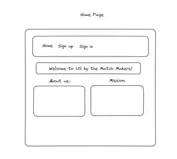
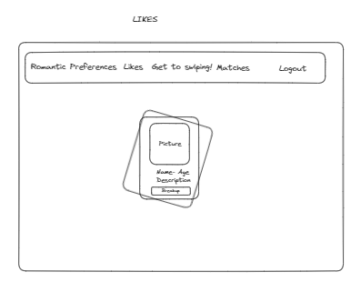
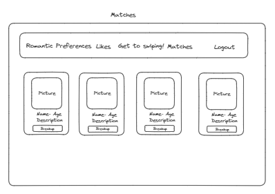

# Us by Match Makers

---

-   Sean Lim
-   D'Angelo DeNiro
-   Yadriel Ruiz Vega
-   Michaela Arteberry

## Functionality

---

New users can create an account by signing up or an existing user may sign in to their account. They will set their romantic preferences that will filter the other users on our application, and reveal those filtered users to the current user. The user can make 'swipes'(click and drag), or simply press a like or dislike button on a user card that appears to them. A user can view other users that have given them a like. A user can return a like, or decline a like with a push of a button. A user can view a page that has their matches, users they have likes, who also liked them back.

### User Stories/Scenarios
    Scenario: User visits page for the first time
        Given the user is signing up for our application
        When the user enters valid form entries
        And clicks on the submit button
        Then the User is redirected to establish his/hers/their romantic preferences
        And then should be redirected to the swiping page to get started on making relationships


# Wireframe







# Database Model Documentation

## gender TABLE:
### Summary: Database holds information for available genders a user can designate as their own, for example: Male, Female etc. This database table is intended to grow and shrink in accordance with societal norms.
    id              - SERIAL Given automatically when a gender is added to the table
    gender_name     - VARCHAR(20) the string representation of the specific gender, and how it will appear for the user within the application

## romantic_pref TABLE
### Summary: Database holds information for a user's romantic preferences in order to display appropriate potential users that are appropraitely able to be matched with the logged-in user.
    id              - SERIAL given automatically to identify the instance of the romantic preferences table
    user1_id        - INT the user's ID that this set of romantic preferences belongs to. Foreign key of user TABLE
    min_age         - INT the minimum age that the user is seeking
    max_age         - INT the maximum age that the user is seeking
    gender_id       - INT the gender the user is seeking. Foreign key of gender TABLE

## likes TABLE
### Summary: Database holds information for every instance a user using the appplication has "liked" another user
    id              - SERIAL given automatically to identify the instance of a user "liking" another user
    logged_in_user  - INT the ID of the user who initially liked another user. Foreign key of user TABLE
    liked_by_user   - INT the ID of the user who may, or may not have liked them back. Foreign key of the user TABLE
    status          - BOOLEAN whether both of the users have liked each other. NULL is assigned whenever the liked_by_user has not yet made a decision with the logged_in_users profile, FALSE is used when they dislike it

## Match TABLE:
Summary: Upon acceptance of a like, the user who sent the like is then moved to a matches array where there profile can be listed.
    User_1: This will be the column in which the user who sent the like will be stored.

## User_Information TABLE:
### Summary: A collection of information to be stored under a User table which will be used to create an User Profile where they can meet and match with other people that can lead to a potential romantic relationship.
    User ID: An unique identifier for each user instance created in the Database
    First_Name: First name of the user
    Last_Name: Last name of the user
    Password: A protected string known only to the user and administrators
    Location: The vicinity in which the user is located/would like to be shown
    Gender: A foreign key that organizes a user by their gender
    Picture_Url: A photo of the user
    Matches: A list of their matches
    Preferences: The gender that the user is interested in which will be used to display other potential users on the likes page.


## API DOCUMENTATION
The application uses APIs to connect to a database for user management. Users can create profiles and verify connections to interact with others. They can set preferences such as gender and age range to swipe on potential matches.
User Authentication
Summary
Contains API routes and database queries for user authentication.

# API Routes
POST /api/auth/signup: Creates a new user when someone submits the signup form

- Expected input:
    {
"username": "string",
"password": "string",
"first_name": "string",
"last_name": "string",
"location": "string",
"gender": 0,
"age": 0,
"description": "string",
"picture_url": "string"
    }

- Expected Output:
{
"id": 0,
"username": "string"
}


POST /api/auth/signin: Signs the user in when they use the Sign In form

- Expected Input:
{
"username": "string",
"password": "string"
}

Expected Output:
{
"id": 0,
"username": "string"
}   


GET /api/auth/authenticate: Returns the user if the user is logged in

- Expected Response:
{
"id": 0,
"username": "string"
}


DELETE /api/auth/signout: Signs the user out by deleting their JWT Cookie

- Expected Output:
"Signed out successfully"


GET /api/auth/api/users: Get all users

- Expected Output:
[
    {
    "id": 0,
    "username": "string",
    "first_name": "string",
    "last_name": "string",
    "age": 0,
    "gender": 0
    }
]


GET /api/auth/api/users/gender: Gets users by gender if a user is authenticated

- Expected Output:
[
    {
    "id": 0,
    "username": "string",
    "first_name": "string",
    "last_name": "string",
    "age": 0,
    "gender": 0
    }
]


POST /api/auth/api/users/likes: Adds a like from one user to another

- Expected Input:
{
"logged_in_user": 1,
"liked_by_user": 2,
"status": true
}

- Expected Output:
{
"id": 1,
"logged_in_user": 1,
"liked_by_user": 2,
"status": true
}


GET /api/auth/api/users/matches: Retrieves a list of matches for a user

- Expected Output:

[
    {
    "id": 1,
    "logged_in_user": 5,
    "liked_by_user": 5,
    "status": true
    }
]
## Project layout

        ### Matching System
            - Filtering Algorithm
            - User Actions (Likes/Dislikes, Viewing Profiles)
            - Matches Page

## Intended Market

---

We are targeting individuals that want to connect with others, to start a romantic relationship.


# Wireframe


## Database Models

Tables:

    gender - Houses genders to include 3 premade genders (Male, Female, Non-Binary). More maybe inserted into the table via migration.
        SERIAL PRIMARY KEY NOT NULL      - id                  - The unique identifier of each gender
        VARCHAR(20) NOT NULL             - gender_name         - The name of the gender as the user expects it (IE 'Male' or 'Female')

    Pre inserted genders:
        id = 1, gender_name = Male
        id = 2, gender_name = Female
        id = 3, gender_name = Non-Binary


    romantic_pref - Houses all users romantic preferences as designated by the user when finalizing their profile.
        SERIAL PRIMARY KEY NOT NULL      - id                  - The unique identifier of each user's romantic preference
        INT NOT NULL                     - user1_id            - The user this set of romantic preferences belongs to (Foreign Key of 'id' in users table)
        INT NOT NULL                     - min_age             - The minimum age the user wants to interact with
        INT NOT NULL                     - max_age             - The maximum age the user wants to interact with
        INT NOT NULL                     - gender_id           - The gender the user wants to interact with (Foreign Key of 'id' in gender table)


    likes - Houses all of the instinces in which one user has 'liked' another user.
        SERIAL PRIMARY KEY NOT NULL      - id                  - The unique identifier of each like instance
        INT NOT NULL                     - logged_in_user      - The user who is recieving the like (Foreign Key of 'id' in users table)
        INT NOT NULL                     - liked_by_user       - The user who is giving the like (Foreign Key of 'id' in users table)


    users - Houses all of the users who have created an account on the site.
        SERIAL PRIMARY KEY NOT NULL      - id                  - The unique identifier of each user instance
        VARCHAR(100)                     - username            - The username the user designated for themselves upon account creation
        VARCHAR(256)                     - password            - The password the user designated for themselves upon account creation
        VARCHAR(100)                     - first_name          - The first name the user designated for themselves upon account creation
        VARCHAR(100)                     - last_name           - The last name the user designated for themselves upon account creation
        VARCHAR(50)                      - location            - The location the user designated for themselves upon account creation
        INT                              - gender              - The gender the user designated for themselves upon account creation (Foreign Key of 'id' in gender table)
        INT                              - age                 - The age the user designated for themselves upon account creation
        VARCHAR(1000)                    - description         - The self description the user designated for themselves upon account creation
        VARCHAR(256)                     - picture_url         - The picture's url the user designated for themselves upon account creation


## API DOCUMENTATION

The application uses APIs to connect to a database for user management. Users can create profiles and verify connections to interact with others. They can set preferences such as gender and age range to swipe on potential matches.

User Authentication
Summary
Contains API routes and database queries for user authentication.

## API Routes

### Auth Routers
**POST** /api/auth/signup: Creates a new user when someone submits the signup form

    - Expected input:
        {
    "username": "string",
    "password": "string",
    "first_name": "string",
    "last_name": "string",
    "location": "string",
    "gender": 0,
    "age": 0,
    "description": "string",
    "picture_url": "string"
        }

    - Expected Output:
    {
    "id": 0,
    "username": "string"
    }


**POST** /api/auth/signin: Signs the user in when they use the Sign In form

    - Expected Input:
    {
    "username": "string",
    "password": "string"
    }

    Expected Output:
    {
    "id": 0,
    "username": "string"
    }

**GET** /api/auth/authenticate: Returns the user if the user is logged in

    - Expected Response:
    {
    "id": 0,
    "username": "string"
    }

**DELETE** /api/auth/signout: Signs the user out by deleting their JWT Cookie

    - Expected Output:
    "Signed out successfully"

**GET** /api/auth/users: Get all users

    - Expected Output:
    [
        {
        "id": 0,
        "username": "string",
        "first_name": "string",
        "last_name": "string",
        "age": 0,
        "gender": 0
        "description": "string"
        }
    ]

### Genders

**GET** /api/genders: Get all genders

    - Expected Output:
    [
        {
        "id": 0,
        "gender_name": 0
        }
    ]

### Likes


**POST** /api/likes: Create a Like

    - Expected Input:
        -{
        "logged_in_user": 0,
        "liked_by_user": 0,
        "status": true
        }

    - Expected Output:
        -{
        "id": 0,
        "logged_in_user": 0,
        liked_by_user": 0,
        "status": true
        }

**GET** /api/likes: Get all likes
    - Expected Output:
        - {
        "additionalProp1": [
            {
            "id": 0,
            "logged_in_user": 0,
            "liked_by_user": 0,
            "status": true
            }
            ]
        }

**PUT** /api/auth/likes/<int:id>: Update Like Status

    - Expected Input:
        - ID
        - {
        "logged_in_user": 0,
        "liked_by_user": 0,
        "status": true
        }
        or
        - {
        "logged_in_user": 0,
        "liked_by_user": 0,
        "status": false
        }

    - Expected Output:
        - {
        "logged_in_user": 0,
        "liked_by_user": 0,
        "status": true
        }
        or
        - {
        "logged_in_user": 0,
        "liked_by_user": 0,
        "status": false
        }

### Preferences

**GET** /api/filtered-preferences: Filter by preferences

    - Expected output:
        - [
        {
            "id": 0,
            "picture_url": "string",
            "username": "string",
            "first_name": "string",
            "last_name": "string",
            "age": 0,
            "gender": 0,
            "description": "string"
        }
        ]

**POST** /api/preferences: Create a preferences
    - Expected input:
        -{
        "user1_id": 0,
        "min_age": 0,
        "max_age": 0,
        "gender_id": 0
        }

    - Expected output:
        -{
        "id": 0,
        "user1_id": 0,
        "min_age": 0,
        "max_age": 0,
        "gender_id": 0
        }

**GET** /api/preferences: Get all preferences
    - Expected output:
        -[
        {
        "id": 0,
        "user1_id": 0,
        "min_age": 0,
        "max_age": 0,
        "gender_id": 0
        }
        ]

**PUT** /api/prefereneces/<int:id>: Update a preference
    - Expected input:
        -{
        "user1_id": 0,
        "min_age": 0,
        "max_age": 0,
        "gender_id": 0
        }
     Expected output:
        -{
        "id": 0,
        "user1_id": 0,
        "min_age": 0,
        "max_age": 0,
        "gender_id": 0
        }

### Matches

**GET** /api/matches: Get User Matches

    - Expected Output:
        - {
        "additionalProp1": [
        {
        "id": 1,
        "logged_in_user": 1,
        "liked_by_user": 2
            }
        ],
        }

**DELETE** - /api/user/matches/<int:id> - Delete Match
    - Expected Input:
    Match_id: int

    - Expected Output:
        "string"


## Stretch Goals

---

Nice to have functionalities would be a chat room function for matched users, and allowing users to include interests such as hobbies or favorite music to a users profile. Incorporating a third party Api to use location as a factor in match making algorithm.

## Tech Stack

---

-   Postgresql
-   FastApi
-   React
-   Redux
-   Tailwind
-   Typescript
-   Custom CSS
-   Docker
-   HTML

## Project Initialization

---

To fully enjoy this application on your local machine, please make sure to follow these steps:

1. Clone the repository down to your local machine
2. CD into the new project directory
3. Run docker volume create database_volume
4. Run docker compose build
5. Run docker compose up
6. Run docker exec -it us-api-1 bash
7. Exit the container's CLI, and enjoy US to its fullest!

### Onboarding

---

In order for VSCode's built in code completion and intelligence to
work correctly, it needs the dependencies from the requirements.txt file
installed. We do this inside docker, but not in the workspace.

So we need to create a virtual environment and pip install the requirements.

From inside the `api` folder:

```bash
python -m venv .venv
```

Then activate the virtual environment

```bash
source .venv/bin/activate
```

And finally install the dependencies

```bash
pip install -r requirements.txt
```

Then make sure the venv is selected in VSCode by checking the lower right of the
VSCode status bar


### Unit Tests
Unit Testing:
Michaela Arteberry: test_get_all_genders.py
Ensures that all default genders and custom genders can be retrieved from the database.

D'Angelo DeNiro: test_get_all_likes.py
Ensures that all likes that have occurred on the platform can be retrieved from the database.

Sean Lim: test_get_all_matches.py
Ensures that all the matches that have occurred on the platform can be retrieved from the database.

Yadriel Ruiz Vega: test_get_all_preferences.py
Ensures that all preferences that have been saved on the platform can be retrieved from the database.
